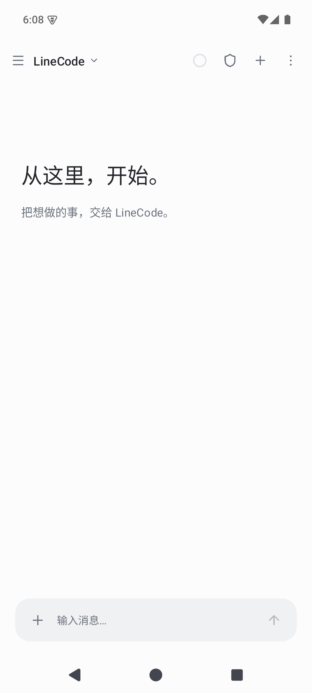
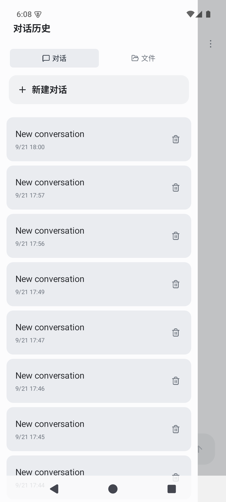
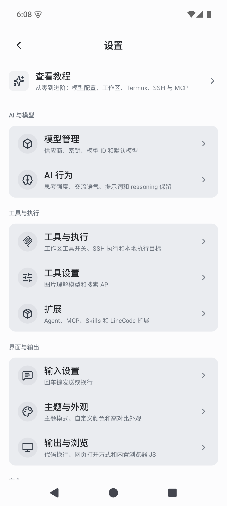

# LineCode Pro

中文 · [English](README.md)

[](https://github.com/LangLang03/LineCodePro/actions/workflows/ci.yml)
[](https://github.com/LangLang03/LineCodePro/releases)
[](LICENSE)
[](CMakeLists.txt)
[](https://github.com/HuxerUI/HuxerUI)
[](platform/android/gradle.properties)

**LineCode Pro 是一个使用现代 C++23 与 HuxerUI 构建的原生跨平台 AI 编程工作区。** 它把流式对话、项目工具、多 Agent 工作流、远程执行、扩展能力和本地数据管理放进一套专注的界面中。

它不只是聊天客户端。模型可以检查选定的工作区、提出或应用文件修改、执行经过授权的命令、搜索网页、处理图片、把任务委派给 Agent，并完成多轮工具调用；整个执行时间线始终可见、可复查。

> LineCode Pro 正在积极开发中。在重要环境中使用 AI 生成的代码或命令前，请务必自行审查。

## 界面预览

<table>
  <tr>
    <td align="center"><br><sub>对话</sub></td>
    <td align="center"><br><sub>项目与历史</sub></td>
    <td align="center"><br><sub>模型、工具与外观</sub></td>
  </tr>
</table>

## 核心能力

- **多协议模型对话**：OpenAI 兼容 Chat Completions、OpenAI/Codex Responses、Anthropic Messages 与本地 GGUF 模型共用同一套流式交互。
- **完整工具循环**：读取、创建、编辑、搜索和整理项目文件，执行 Shell，搜索与读取网页，理解或生成图片，维护任务清单与记忆。
- **Agent 与流水线**：把工作委派给 coding/explore Agent，运行存在依赖关系的阶段，实时查看进度，并把结果带回主对话。
- **多种工作区**：支持 Android 本地目录、SSH 工作区、Termux，以及兼容的 Android 终端提供者服务。
- **可审查的修改**：文件操作生成差异记录；思考、重试、授权、工具调用、输出和最终回复按真实顺序保留在对话时间线中。
- **可扩展能力**：连接 HTTP MCP 服务、定义自定义 Agent、安装项目级或全局 `SKILL.md`，并通过 SkillHub 发现社区 Skills。
- **长任务支持**：上下文用量跟踪、自动压缩、对话检索、长期记忆和可恢复历史，让多轮任务保持连续。
- **原生主题与布局**：HuxerUI 界面覆盖亮色、深色、跟随系统、咖啡纸、高对比度、自定义颜色，以及抽屉、底部面板、弹窗、Markdown 和代码展示。

## 平台状态

| 平台 | 状态 | 说明 |
| --- | --- | --- |
| Android 6.0+（API 23+） | 主要平台 | 发布包为 arm64；模拟器验证可启用 x86_64。包含 Android 专用的后台保活与 Termux 集成。 |
| Windows | 开发中 | 原生 HuxerUI 目标与安装包配置；Android 专属的后台保活选项不会显示。 |

## 隐私与控制

LineCode Pro 使用 SQLite 在本机保存对话、设置、记忆、扩展元数据和差异历史。只有当你明确配置或调用某项服务时，模型凭据及选中的项目内容才会发送给对应服务。工具执行支持自动、确认和只读策略，本地文件工具被限制在当前工作区内。

导出与诊断链路会尽量清除凭据，但分享归档或日志前仍应自行检查。第三方模型、MCP 端点、Skill、SSH 主机和网页服务分别受其自身的隐私与安全政策约束。

## 获取应用

预编译产物和发行说明会发布在 [GitHub Releases](https://github.com/LangLang03/LineCodePro/releases)。Android 发布包继续使用 `cn.lineai` 包名，并延续原 LineCode 的签名和版本序列。

## 从源码构建

当前版本固定使用 **HuxerUI SDK 0.3.0**。官方安装脚本支持 `--version`，请显式指定版本，让本机 SDK 与 CI 保持一致，避免 `latest` 将来变化后产生不兼容：

```sh
curl -fsSL https://github.com/HuxerUI/HuxerUI/releases/latest/download/install.sh | sh -s -- --version 0.3.0 --yes
export HUXERUI_HOME="$HOME/.local/share/HuxerUI"
export PATH="$HUXERUI_HOME/bin:$PATH"
huxerui doctor android
```

Android 构建还需要 JDK 17、Android Platform 36、NDK `29.0.14206865`、CMake 3.22.1 和 Ninja。使用 8 路并行生成可安装的 Debug APK：

```sh
./platform/android/gradlew -p platform/android :app:assembleDebug --max-workers=8
```

使用 Ninja 运行原生 GoogleTest 测试：

```sh
cmake -S tests -B build/tests-ninja -G Ninja -DCMAKE_BUILD_TYPE=Release
cmake --build build/tests-ninja --parallel 8
ctest --test-dir build/tests-ninja --output-on-failure -j8
```

Windows 上请安装相同版本的 HuxerUI SDK，然后执行 `huxerui package windows --project . --config Release`。签名 Android Release 还需要私有签名配置，并由发布工作流生成；任何签名材料都不能提交到仓库。

## 讨论与反馈

- QQ 交流群：**1023548832**
- 一般问题与设计讨论：[GitHub Discussions](https://github.com/LangLang03/LineCodePro/discussions)
- 可复现缺陷与边界明确的需求：[GitHub Issues](https://github.com/LangLang03/LineCodePro/issues)

QQ群仅用于社区讨论。商业许可、CLA 或其他法律相关问题请联系 **jiyu03@qq.com**。

## 参与贡献

欢迎贡献。项目使用 C++23、HuxerUI、依赖倒置与单一职责边界，并由 GoogleTest 和 Android 自动检查守护。提交 PR 前请阅读 [CONTRIBUTING.md](CONTRIBUTING.md)。

每个拉取请求都必须填写贡献者的 GitHub 用户名，作为接受 [CLA.md](CLA.md) 的电子签名。必需的 `CLA / verify` CI 检查会拒绝未签署 CLA 的 PR。

## 许可

LineCode Pro 采用双许可模式：

- 开源使用遵循 **GNU AGPL v3 或任何更新版本**，详见 [LICENSING.md](LICENSING.md) 与 [LICENSE](LICENSE)。
- 无法履行 AGPL 义务的组织可以申请单独的商业许可，详见 [COMMERCIAL-LICENSE.md](COMMERCIAL-LICENSE.md)。

除非另有书面商业协议，仅获得或使用源代码并不自动获得商业许可例外。

## 特别鸣谢

特别感谢 [HuxerUI](https://github.com/HuxerUI/HuxerUI) 为 LineCode Pro 提供原生跨平台 UI 框架。HuxerUI 使用 **MIT License** 开源，其版权声明与完整条款见 [HuxerUI LICENSE](https://github.com/HuxerUI/HuxerUI/blob/main/LICENSE)。HuxerUI 及其他第三方组件始终遵循各自的许可协议。
